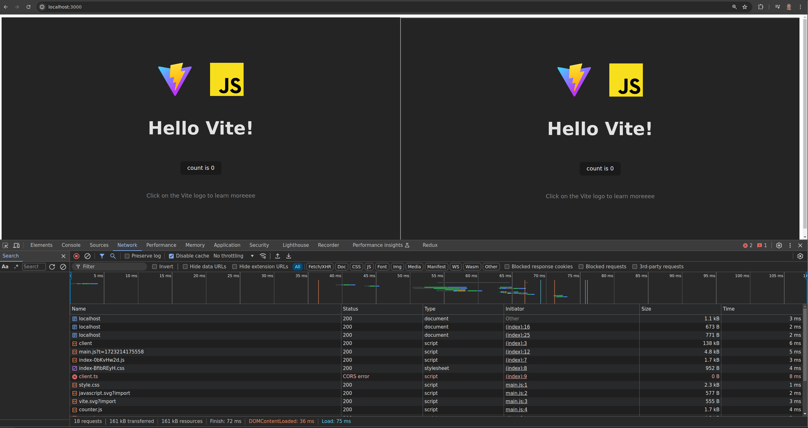

```shell
npm install

# Run regular Vite server (http://localhost:4001)
npm run dev

# Serve the same page with vite-live-preview (http://localhost:4002)
npm run live-preview

# Serve a page with two iframes, one for dev and one for live-preview (http://localhost:3000)
npm run iframe
```

You will be able to access `http://localhost:3000/`. If you check the devtools, you will see that `client.ts` is rejected by CORS. The non-`vite-live-preview` server manages to load its client file.



The problem occurs because the iframe is in a sandbox without `allow-same-origin` (check the `index.html` file), but this only affects `vite-live-preview`. This is because the `client.ts` script has the `crossorigin` attribute.
